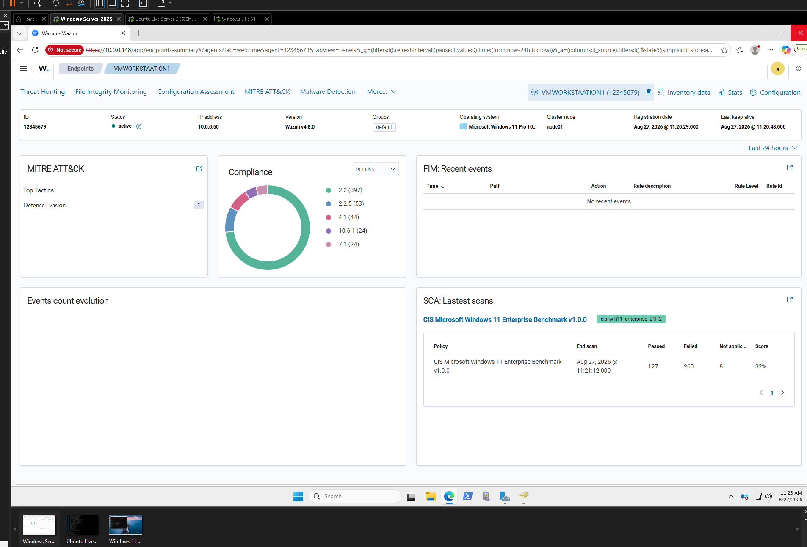
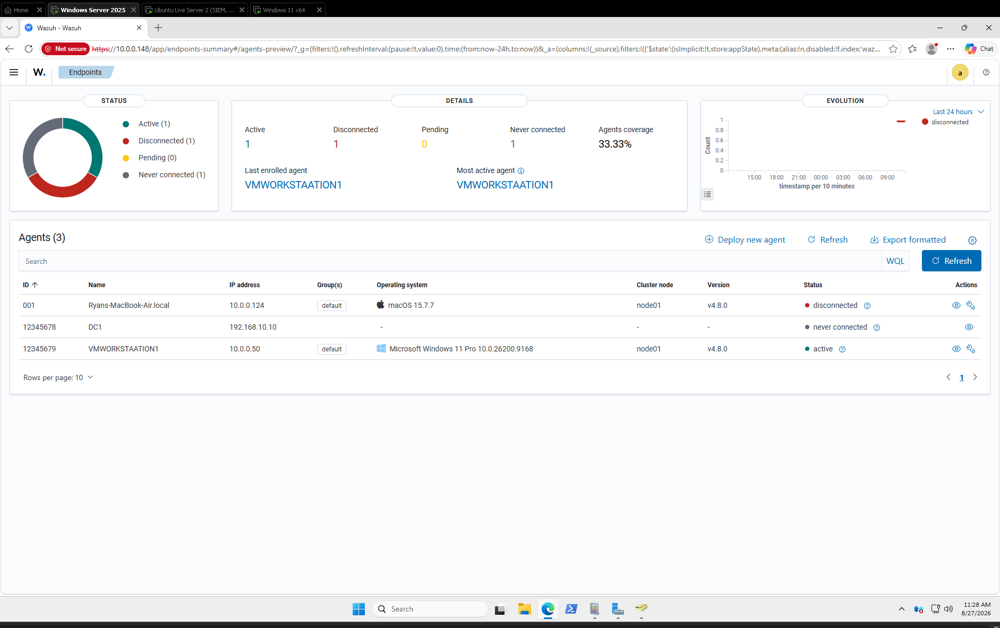
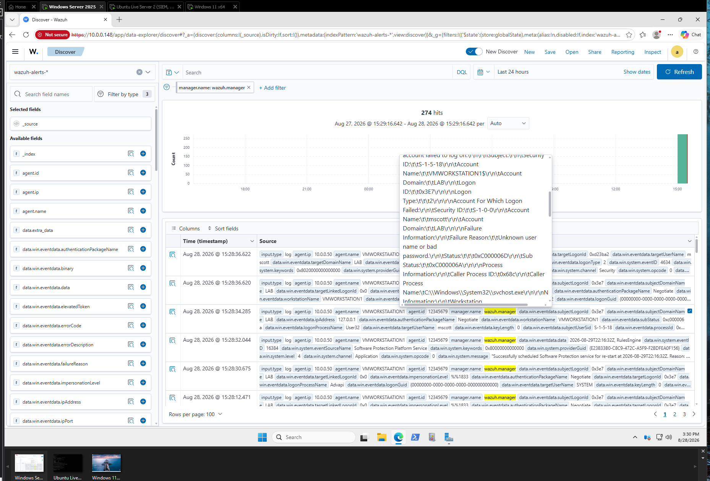
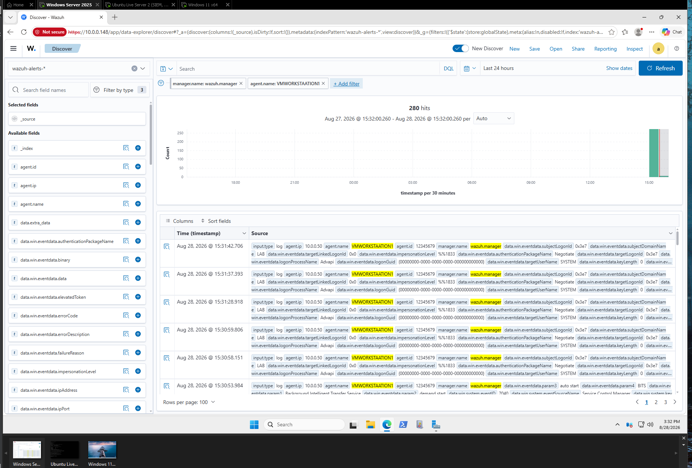

# ubuntu-hosted-wazuh-siem-docker-lab
SIEM deployment with Wazuh in Docker, multi-platform agent enrollment, CIS benchmark compliance scanning, and real time security log analysis.
# Open-Source SIEM Deployment and Security Telemetry Wazuh and Docker

This repository documents the deployment of an enterprise open-source SIEM using **Wazuh** running in Docker on an Ubuntu Live Server instance on a VMWare VM. It details agent deployment across multi-platform endpoints, Security Configuration Assessment, compliance auditing, and central threat detection event ingestion.

---

## Technical Overview

* **SIEM Manager Host:** Ubuntu Server running Wazuh Manager (v4.8.0) via Docker Containers
* **Monitored Endpoints:**
  * `VMWORKSTATION1` (Windows 11 Pro - Agent ID: `12345679`)
  * `MacBook-Air.local` (macOS 15.7.7 - Agent ID: `001 - previously connected`)
  * `DC1` (Windows Server - Agent ID: `12345678`)
* **Core Capabilities:** SCA, MITRE ATT&CK mapping, PCI DSS compliance auditing, and real time security event log monitoring.

---

## Architecture & Deployment

### 1. Endpoint Dashboard & SCA
Configured the Wazuh agent on `VMWORKSTATION1` to collect real time system metrics and run automated compliance benchmark. Evaluated host security posture against the **CIS Microsoft Windows 11 Enterprise Benchmark v1.0.0**.

* **Agent Status:** Active
* **Compliance Checks:** PCI DSS regulatory mapping and MITRE ATT&CK Defense Evasion tagging.
* **SCA Results:** Scanned 395 controls with 127 Passed, 260 Failed.

---

### 2. Multi-Platform Agent Management
Enrolled multiple endpoint operating systems into the central Manager node (`node01`). Configured daemon communications and monitored agent connectivity status across macOS and Windows hosts.

* **Windows Agent:** `VMWORKSTATION1` - Active
* **macOS Agent:** `MacBook-Air.local` - Previously Active

---

### 3. Real Time Telemetry and Event ID Analysis
Ingested endpoint security event logs into the central Indexer repository (`wazuh-alerts-*`). Inspected raw telemetry in the **Discover** panel to analyze security event details, such as an unauthorized login attempt (`mscott`) resulting in a Windows Security Audit Failure.

* **Ingested Event:** Windows Logon Failure (**Event ID 4625**)
* **Target Account:** `mscott`
* **Caller Process:** `C:\Windows\System32\svchost.exe`
* **Failure Code:** `0xC000006D` / Sub Status `0xC000006A`

---

### 4. Focused Threat Hunting and Agent Event Stream
Filtered alert indices (`manager.name: wazuh.manager AND agent.name: VMWORKSTATION1`) to establish a real time event pipeline for endpoint activity monitoring and threat detection verification.

---

## Implementation Summary

1. Deployed the **Wazuh SIEM stack** (Manager, Indexer, Dashboard) on Ubuntu Server utilizing Docker containers.
2. Enrolled Windows 11 and macOS agents, establishing secure TLS encryption forming secure agent to manager communication.
3. Executed automated **CIS Benchmark** scans to identify opportunities to harden further.
4. Filtered and analyzed Windows event logs in real time for threat detection and SOC visibility.
